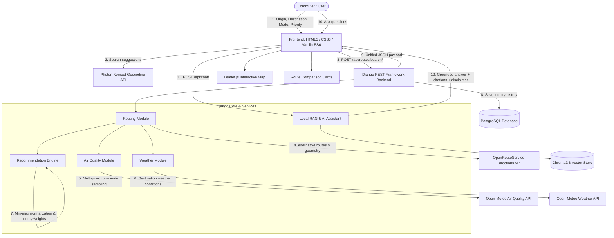

# CleanRoute AI

### *An AI-Powered Air-Quality-Aware Sustainable Travel Route Recommendation System*

[](https://www.python.org/)
[](https://www.djangoproject.com/)
[](https://www.postgresql.org/)
[](LICENSE)
[]()
[]()

---

## 1. Project Overview & Problem Statement

Urban air pollution is one of the leading environmental health risks worldwide, contributing to millions of premature cardiopulmonary deaths and exacerbating respiratory ailments like asthma and COPD. Traditional navigation applications (such as Google Maps or Apple Maps) optimize travel almost exclusively for transit time and distance. As a result, pedestrians, cyclists, and commuters are routinely routed along congested arterial highways, vehicle choke points, and high-emission corridors.

**CleanRoute AI** redefines urban navigation by making atmospheric health and sustainable mobility active decision variables in journey planning. By combining real road routing from **OpenRouteService**, real-time atmospheric criteria pollutant tracking from **Open-Meteo**, a transparent **deterministic multi-criteria recommendation engine**, and a grounded **Local RAG conversational assistant**, CleanRoute AI empowers commuters to choose healthier, low-emission travel corridors.

---

## 2. Key Features

- 🔍 **Search-As-You-Type Geocoding**: Real-time autocomplete suggestions powered by the Photon Komoot API with zero hardcoded assumptions.
- 🗺️ **Multi-Modal Road Routing**: Navigable route generation via OpenRouteService Directions API across **Walking**, **Cycling**, and **Driving**.
- 🍃 **Live Air Quality & Weather Tracking**: Integration with Open-Meteo APIs for live criteria pollutants ($PM_{2.5}, PM_{10}, NO_2, O_3, SO_2, CO$, European AQI, and US AQI) and atmospheric weather.
- 📊 **Multi-Route Comparison**: Retrieves and renders up to 3 viable route alternatives with distinctive color-coded polylines and interactive Leaflet map layers.
- ⚖️ **Deterministic Recommendation Engine**: Min-max normalized, mathematically weighted route ranking across user-selected priorities: **Health First** (60/20/20), **Balanced** (40/30/30), and **Time First** (20/60/20).
- 🤖 **Grounded AI Assistant (Local RAG)**: Context-aware conversational assistant backed by a local ChromaDB vector knowledge base covering WHO air quality standards and sustainable transit guidelines.
- 🛡️ **Responsible AI & Ethics Guardrails**: Fully explainable scoring, multi-modal inclusivity, zero user location tracking, and an explicit, permanent non-medical advisory disclaimer.
- 🚀 **Production-Ready Architecture**: Configured with WhiteNoise, Gunicorn, PostgreSQL connection pooling, and Render Blueprint deployment (`render.yaml`).

---

## 3. End-to-End System Architecture



---

## 4. Technology Stack

| Layer | Technologies Used |
| :--- | :--- |
| **Frontend** | HTML5, Modern Vanilla CSS (Design Tokens, Glassmorphism, Responsive CSS Grid), Vanilla ES6+ JavaScript, Leaflet 1.9.4 |
| **Backend** | Python 3.11+, Django 5.1+, Django REST Framework 3.15+, django-cors-headers, WhiteNoise |
| **Database** | PostgreSQL 15+ (psycopg 3 binary driver, dj-database-url) |
| **APIs & Data** | Photon Komoot (Geocoding), OpenRouteService (Routing), Open-Meteo (Weather & Air Quality) |
| **Vector AI & RAG** | ChromaDB, Local Document Embeddings, Grounded Response Synthesizer |
| **Production Server** | Gunicorn WSGI Server, Render Cloud Platform (`render.yaml`) |

---

## 5. Supported Travel Modes

1. **Walking** (`walking` / `foot-walking`): Prioritizes pedestrian corridors, walkways, and park paths away from heavy vehicle traffic.
2. **Cycling** (`cycling` / `cycling-regular`): Optimizes for bicycle lanes, designated cycle tracks, and lower-stress secondary streets.
3. **Driving** (`driving` / `driving-car`): Navigable road network for vehicular transit with real-time exposure trade-offs.

---

## 6. Priority Preferences & Scoring Engine

CleanRoute AI rejects opaque black-box recommendations in favor of a **deterministic multi-criteria mathematical model**.

### Mathematical Formula:
For each route alternative $i$, the overall score $S_i \in [10.0, 99.0]$ is calculated as:
$$S_i = (w_{pollution} \times N_{pollution, i}) + (w_{time} \times N_{time, i}) + (w_{distance} \times N_{distance, i})$$

Where each sub-score $N_{metric, i}$ is computed via inverted min-max normalization (where lower duration, shorter distance, and lower pollution exposure are better):
$$N(x_i) = 100.0 \times \frac{\max(X) - x_i}{\max(X) - \min(X)}$$
*(If all candidate routes have identical values for a metric, $N(x_i) = 100.0$.)*

### Weight Vectors by Priority:
| Priority Preference | Pollution Weight ($w_{poll}$) | Time Weight ($w_{time}$) | Distance Weight ($w_{dist}$) | Focus |
| :--- | :---: | :---: | :---: | :--- |
| **Health First** | **60%** | **20%** | **20%** | Minimizes exposure to PM2.5, NO2, and traffic emissions. |
| **Balanced** | **40%** | **30%** | **30%** | Equitable balance between travel time, distance, and air quality. |
| **Time First** | **20%** | **60%** | **20%** | Minimizes transit duration while retaining baseline pollution awareness. |

---

## 7. Environmental Intelligence Integration

- **Air Quality Provider**: Open-Meteo Air Quality API (`https://air-quality-api.open-meteo.com/v1/air-quality`).
  - Measures: European AQI, US AQI, $PM_{2.5}, PM_{10}, NO_2, O_3, SO_2, CO$.
  - Multi-Point Sampling: The backend samples coordinates along the route geometry, computing route-level average AQI and qualitative exposure tiers:
    - `Low estimated pollution exposure` (AQI $\le 50$)
    - `Moderate estimated pollution exposure` (AQI $51 - 100$)
    - `Elevated estimated pollution exposure` (AQI $101 - 150$)
    - `High estimated pollution exposure` (AQI $> 150$)
- **Weather Provider**: Open-Meteo Weather API (`https://api.open-meteo.com/v1/forecast`).
  - Measures: Real-time temperature, WMO weather condition code and text description, relative humidity, wind speed, and precipitation.

---

## 8. Grounded AI Assistant (Local RAG)

CleanRoute AI features a Local Retrieval-Augmented Generation (RAG) assistant that answers commuter inquiries without requiring external paid cloud APIs or subscription keys:
- **Vector Database**: ChromaDB vector store initialized with curated documents:
  - WHO Global Air Quality Guidelines (2021)
  - Air Quality Index (AQI) thresholds and health classifications
  - CleanRoute AI deterministic scoring formulas and architecture
  - Sustainable urban mobility and active transport benefits
- **Grounded Verification**: Answers are synthesized exclusively from retrieved knowledge chunks and active route journey context.
- **Source Transparency**: Every response cites the specific knowledge documents used.

---

## 9. Responsible AI & Ethics Framework

1. **Transparency & Explainability**: Sub-scores for pollution, time, and distance are displayed alongside an explicit `why_recommended` justification on every route card.
2. **Multi-Modal Fairness**: Equitable access across walking, cycling, and driving, prioritizing vulnerable non-motorized commuters.
3. **Privacy by Design**: Zero continuous GPS tracking or movement breadcrumb recording. Only high-level search queries (origin name, destination name, travel mode, preference) are stored.
4. **Resilience & Fallback**: Automatic distance-aware routing switches gracefully for long trips (>80 km), and in-memory route caching prevents rate limiting.
5. **Non-Medical Advisory Disclaimer**: Prominently displayed in the application footer and returned in every API response:
   > *"CleanRoute AI provides informational, pollution-aware travel recommendations based on available routing, environmental and weather data. It does not provide medical advice or guarantee safety."*

---

## 10. Installation & Setup Guide

### Prerequisites
- Python 3.11+
- PostgreSQL 15+ installed and running locally
- Git
- Free OpenRouteService API key from [openrouteservice.org](https://openrouteservice.org)

### Step 1: Clone Repository
```bash
git clone <repository-url>
cd cleanroot
```

### Step 2: Set Up Python Virtual Environment
**On Windows (PowerShell):**
```powershell
python -m venv backend\venv
.\backend\venv\Scripts\Activate.ps1
```

**On Linux / macOS:**
```bash
python3 -m venv backend/venv
source backend/venv/bin/activate
```

### Step 3: Install Dependencies
```bash
pip install -r backend/requirements.txt
```

### Step 4: Configure Environment Variables
Copy `backend/.env.example` to `backend/.env`:
```bash
cp backend/.env.example backend/.env
```
Fill in your database credentials and API key:
```env
DEBUG=True
SECRET_KEY=django-insecure-cleanroute-ai-dev-secret-key-2026
DATABASE_NAME=cleanroute_db
DATABASE_USER=postgres
DATABASE_PASSWORD=your_postgres_password
DATABASE_HOST=localhost
DATABASE_PORT=5432
OPENROUTESERVICE_API_KEY=your_ors_api_key_here
FRONTEND_URL=http://127.0.0.1:5500
```

### Step 5: Database Setup & Migrations
Ensure your PostgreSQL server has the `cleanroute_db` database created:
```sql
CREATE DATABASE cleanroute_db;
```
Run Django migrations and build the local RAG knowledge base:
```bash
cd backend
python manage.py migrate
python manage.py init_rag
```

---

## 11. Running the Application Locally

### Start Backend API Server
```bash
cd backend
python manage.py runserver 127.0.0.1:8000
```
*The Django REST API will be available at `http://127.0.0.1:8000/api/`.*

### Start Frontend Server
In a separate terminal:
```bash
python -m http.server 5500 --directory frontend
```
*Access the web application at **`http://localhost:5500`**.*

---

## 12. Testing & Verification Suite

CleanRoute AI includes a comprehensive test suite with 100% pass rates across all layers.

### 1. Django App Unit Tests (55 Tests)
```bash
cd backend
python manage.py test
```
*Output: `Ran 55 tests ... OK`*

### 2. Real-World Corridor Matrix Tests
Tests multi-city corridors (Delhi, Kolkata, Kalyani, Mumbai), travel modes (Walking, Cycling, Driving), priority sensitivity, and long-distance bypass:
```bash
python scratch/test_real_world_matrix.py
```
*Output: `SUCCESS: ALL REAL-WORLD MATRIX TESTS PASSED!`*

### 3. Edge Case & Failure Mode Validation
Tests missing parameters, out-of-bounds coordinates, identical origin/destination, and adversarial inquiries:
```bash
python scratch/test_edge_cases.py
```
*Output: `SUCCESS: ALL EDGE CASE TESTS PASSED!`*

---

## 13. Production Deployment (Render)

CleanRoute AI is packaged for zero-friction cloud deployment on [Render](https://render.com) using Infrastructure-as-Code (`render.yaml`).

### Deployment Files:
- **`render.yaml`**: Declares the managed PostgreSQL database and the Gunicorn Python web service.
- **`backend/build.sh`**: Installs production dependencies, executes `collectstatic`, and runs database migrations.
- **`backend/requirements.txt`**: Includes `gunicorn`, `whitenoise`, and `dj-database-url`.
- **`backend/config/settings.py`**: Configured with WhiteNoise compressed static storage and database URL parsing.

### Deploying to Render:
1. Push repository to GitHub/GitLab.
2. In Render, select **New** → **Blueprint** and connect the repository.
3. Configure `OPENROUTESERVICE_API_KEY` under Environment Variables.
4. Render automatically provisions the database, executes `build.sh`, and launches Gunicorn.

---

## 14. Documentation Directory

Detailed architectural and technical documentation is organized in the [`docs/`](docs/) directory:
- 📖 [**Architecture & Data Flow**](docs/architecture.md): Deep dive into system components, data flow diagrams, and service design.
- 📡 [**REST API Documentation**](docs/api.md): Complete schema, endpoints, request/response examples for all services.
- 🧪 [**Testing & Verification**](docs/testing.md): Detailed breakdown of unit tests, matrix tests, and edge case validations.
- 🛡️ [**Responsible AI & Ethics**](docs/responsible_ai.md): Full Responsible AI framework, explainability, privacy, and non-medical disclaimer.
- 🚀 [**Deployment Guide**](docs/deployment.md): Step-by-step local setup and Render cloud deployment walkthrough.
- 🌍 [**Sustainability & Impact**](docs/impact.md): Measurable carbon reduction indicators, public health impact, and future roadmap.

---

## 15. License & Acknowledgments

This project is licensed under the MIT License. Developed as part of the 1M1B Virtual Internship Program.

Special thanks to:
- **Open-Meteo** for providing free, open-access weather and atmospheric air-quality APIs.
- **OpenRouteService** (HeiGIT) for the open routing infrastructure.
- **Photon / Komoot** for open-source search-as-you-type geocoding.
- **World Health Organization (WHO)** for public air quality guideline data.
