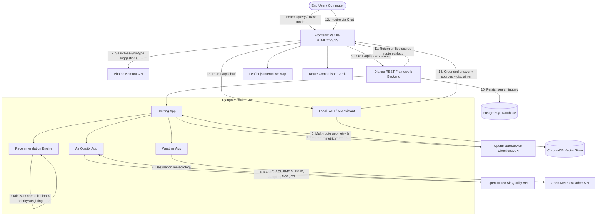

# CleanRoute AI — System Architecture & Data Flow

CleanRoute AI is designed with a decoupled, high-performance architecture consisting of a lightweight responsive frontend, a modular Django REST Framework backend, and external environmental intelligence micro-services.

---

## 1. High-Level Architecture Diagram

---

## 2. Component Specifications

### 2.1 Frontend Client
- **Tech Stack**: HTML5, CSS3 (Vanilla design tokens, CSS variables, glassmorphic UI), Modern ES6+ JavaScript.
- **Mapping Engine**: Leaflet 1.9.4 with OpenStreetMap raster tiles, dynamic color-coded polylines (`#059669` for Recommended, `#0284c7` for Secondary, `#7c3aed` for Tertiary), custom destination pins.
- **Autocomplete**: Debounced input listener calling `/api/geocoding/suggestions/` with keyboard navigation support.
- **State Management**: Session-level caching (`sessionStorage`) to eliminate redundant queries across navigation.

### 2.2 Backend Application Modules
1. **`core`**:
   - Manages global health check (`GET /api/health/`), verifying database connectivity and API responsiveness.
2. **`geocoding`**:
   - Interfaces with Photon Komoot (`https://photon.komoot.io/api/`) for search-as-you-type and Nominatim for coordinate lookup.
3. **`routing`**:
   - Queries OpenRouteService Directions API v2 (`/foot-walking`, `/cycling-regular`, `/driving-car`).
   - Implements distance-aware switching: enables `alternative_routes: {target_count: 3}` for trips < 80 km; switches cleanly to primary routing for trips >= 80 km (e.g. Delhi to Kolkata).
   - In-memory route caching with 30-minute freshness window.
4. **`air_quality`**:
   - Connects to Open-Meteo Air Quality API (`https://air-quality-api.open-meteo.com/v1/air-quality`).
   - Gathers criteria pollutants: European AQI, US AQI, PM2.5, PM10, Nitrogen Dioxide ($NO_2$), Ozone ($O_3$), Sulphur Dioxide ($SO_2$), and Carbon Monoxide ($CO$).
   - Performs multi-point route coordinate sampling along extracted geometry polylines.
5. **`recommendation`**:
   - Applies deterministic multi-criteria mathematical weighting:
     - Health First: 60% Pollution, 20% Time, 20% Distance
     - Balanced: 40% Pollution, 30% Time, 30% Distance
     - Time First: 20% Pollution, 60% Time, 20% Distance
   - Min-max inverted normalization on a 0.0 to 100.0 scale.
   - Deterministic sorting and tie-breaking: `(-overall_score, duration, distance, id)`.
6. **`weather`**:
   - Fetches live temperature, weather condition code, humidity, wind speed, and precipitation from Open-Meteo.
7. **`rag` & `ai_assistant`**:
   - Local ChromaDB vector database storing WHO air quality and sustainable transport knowledge documents.
   - Grounded context retrieval and synthesis with mandatory non-medical disclaimer.

### 2.3 Relational Database Layer (PostgreSQL)
- Schema managed via standard Django ORM migrations.
- Tracks `RouteSearch` inquiry history:
  - `origin_name`: varchar(255)
  - `destination_name`: varchar(255)
  - `travel_mode`: varchar(20) choices (`walking`, `cycling`, `driving`)
  - `route_preference`: varchar(20) choices (`health_first`, `balanced`, `time_first`)
  - `created_at`: timestamp with time zone (indexed)

---

## 3. Production Infrastructure & Deployment
- **WSGI Server**: Gunicorn multi-worker HTTP server.
- **Static Assets**: WhiteNoise middleware with compressed manifest storage.
- **Database Configuration**: 12-factor `DATABASE_URL` parsing via `dj-database-url`.
- **Hosting Target**: Render Web Service + Render PostgreSQL Managed Instance (`render.yaml`).
